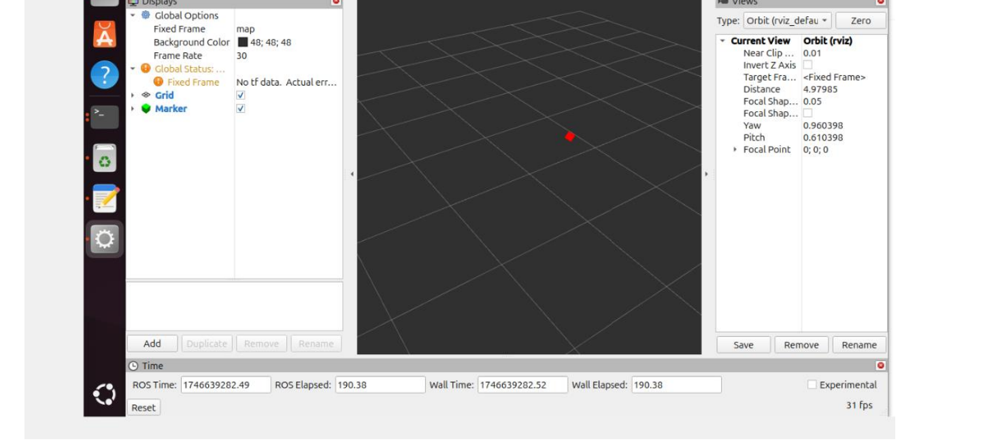
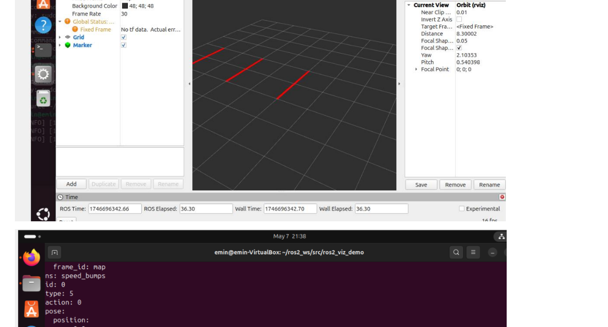
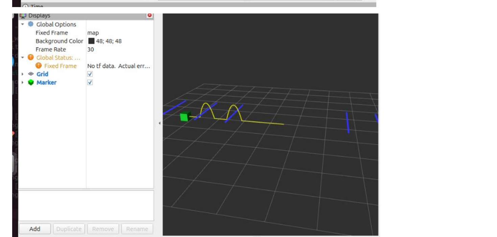
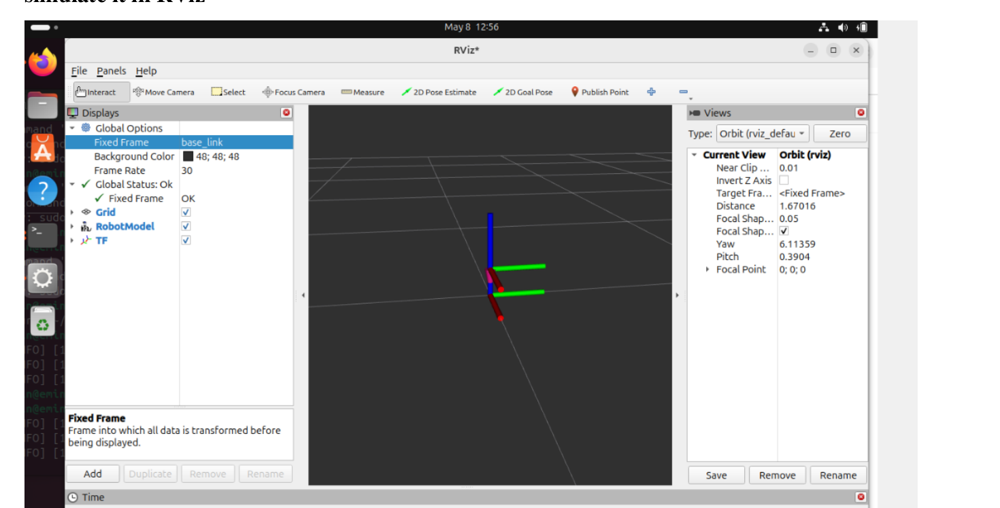

# ROS2 Visualization Demo — RViz2

A ROS2 Python package demonstrating real-time 3D visualization using **RViz2**. Built as part of the *Robotic System Design Frameworks* course at Vilnius University, Šiauliai Academy. Covers marker publishing, pose tracking, animated object movement, and URDF robot modeling with TF2.

---

## Table of Contents

- [Overview](#overview)
- [Features](#features)
- [Demo Screenshots](#demo-screenshots)
- [Project Structure](#project-structure)
- [Prerequisites](#prerequisites)
- [Installation & Build](#installation--build)
- [Running the Nodes](#running-the-nodes)
- [Key Concepts](#key-concepts)

---

## Overview

This project explores the core building blocks of ROS2 visualization:

- Publishing geometry and marker messages that RViz2 can render in real time
- Animating objects (points, cubes) along dynamic paths
- Attaching a `geometry_msgs/Pose` arrow to a moving object so direction is always visible
- Modeling a simple robot in URDF and simulating it with `robot_state_publisher` and TF2

---

## Features

| # | Feature | ROS2 Message Type |
|---|---------|-------------------|
| 1 | Point moving along a circular path | `visualization_msgs/Marker` (SPHERE) |
| 2 | Pose arrow + random LineList bars | `geometry_msgs/PoseStamped` + `visualization_msgs/MarkerArray` |
| 3 | Cube navigating around obstacles with arc/sine-wave motion | `visualization_msgs/Marker` (CUBE) |
| 4 | Pose arrow always attached to the cube, showing direction | `geometry_msgs/PoseStamped` |
| 5 | URDF robot with two joints visualized via TF2 | URDF + `sensor_msgs/JointState` |

---

## Demo Screenshots

### 1 · Circular Point Publisher
A `geometry_msgs/Point` is published at 10 Hz, with x and y coordinates computed using `sin` and `cos` to trace a smooth circle. RViz2 shows the point moving in real time.



---

### 2 · Pose + MarkerArray with LineList
A `PoseStamped` message is published to drive the RViz2 pose arrow. A `MarkerArray` containing a `LINE_LIST` marker places vertical bars at random positions along the X axis — simulating obstacles in the environment.



---

### 3 & 4 · Moving Cube with Direction Arrow
A cube marker moves through the scene navigating around the random bars using arc (sine-wave) movements. A pose arrow is always attached to the cube and updates its orientation every frame to show the current travel direction. Only one cube and one arrow are visible at any point in time.



---

### 5 · URDF Robot with Two Joints (TF2)
A minimal URDF robot with two revolute joints is loaded and published by `robot_state_publisher`. TF2 broadcasts the transforms for each link so RViz2 can display the full kinematic chain and coordinate frames.



---

## Project Structure

```
ros2_viz_demo/
├── ros2_viz_demo/
│   ├── circular_point.py        # Task 1 – publishes a point on a circular path
│   ├── pose_linelist.py         # Task 2 – pose arrow + random LINE_LIST bars
│   ├── curved_trail_node.py     # Tasks 3 & 4 – moving cube with attached pose arrow
│   └── ...
├── urdf/
│   └── simple_robot.urdf        # Task 5 – two-joint robot model
├── launch/
│   └── viz_demo.launch.py       # Launch file for all nodes
├── package.xml
├── setup.py
└── README.md
```

---

## Prerequisites

- **ROS2 Jazzy** (or Humble) installed and sourced
- **RViz2** — comes with a standard ROS2 desktop install
- Python 3.10+

```bash
# Verify ROS2 is available
ros2 --version
```

---

## Installation & Build

```bash
# Clone into your ROS2 workspace
cd ~/ros2_ws/src
git clone https://github.com/emins1856/ros2_viz_demo.git

# Build the package
cd ~/ros2_ws
colcon build --packages-select ros2_viz_demo

# Source the workspace
source install/setup.bash
```

---

## Running the Nodes

### Task 1 — Circular Point
```bash
ros2 run ros2_viz_demo circular_point
```

### Task 2 — Pose + LineList Bars
```bash
ros2 run ros2_viz_demo pose_linelist
```

### Tasks 3 & 4 — Moving Cube with Pose Arrow
```bash
ros2 run ros2_viz_demo curved_trail_node
```

### Task 5 — URDF Robot
```bash
ros2 launch ros2_viz_demo viz_demo.launch.py
```

Then open **RViz2** in a separate terminal:
```bash
rviz2
```

In RViz2, set the **Fixed Frame** to `map` (or `base_link` for the URDF task) and add a `Marker` / `MarkerArray` / `RobotModel` / `TF` display depending on which node you are running.

---

## Key Concepts

**RViz2** is ROS2's primary 3D visualization tool. It subscribes to topics and renders geometry, markers, robot models, and sensor data in a 3D scene. Every message must share the same `frame_id` (e.g. `map`) so RViz2 can place them correctly relative to each other.

**URDF** (Unified Robot Description Format) is an XML format that describes a robot's physical structure — its links (rigid bodies) and joints (connections between links). Once loaded, `robot_state_publisher` converts the URDF and incoming joint states into TF2 transforms.

**TF2** is ROS2's coordinate frame tracking system. It maintains a transform tree so every part of the robot's body can be located in 3D space at any point in time. TF2 and URDF work together to animate and display robot motion correctly in RViz2.

---

Author
Emin Samadov
Software Engineering (Robotics Systems) — Vilnius University
GitHub: github.com/emins1856
